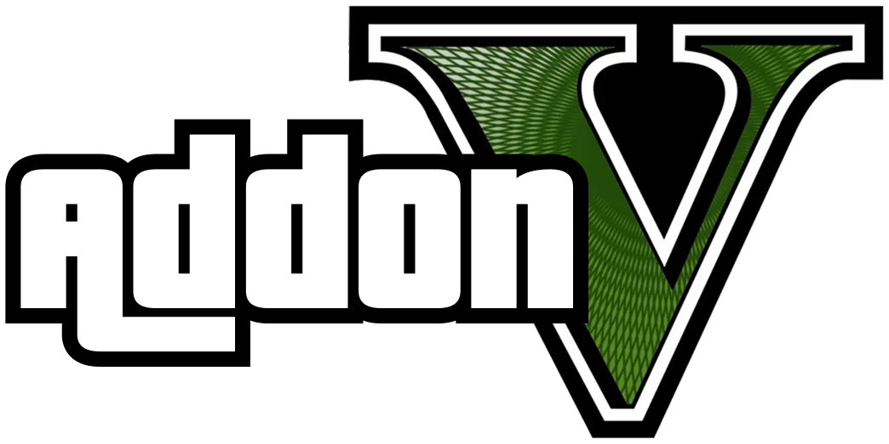
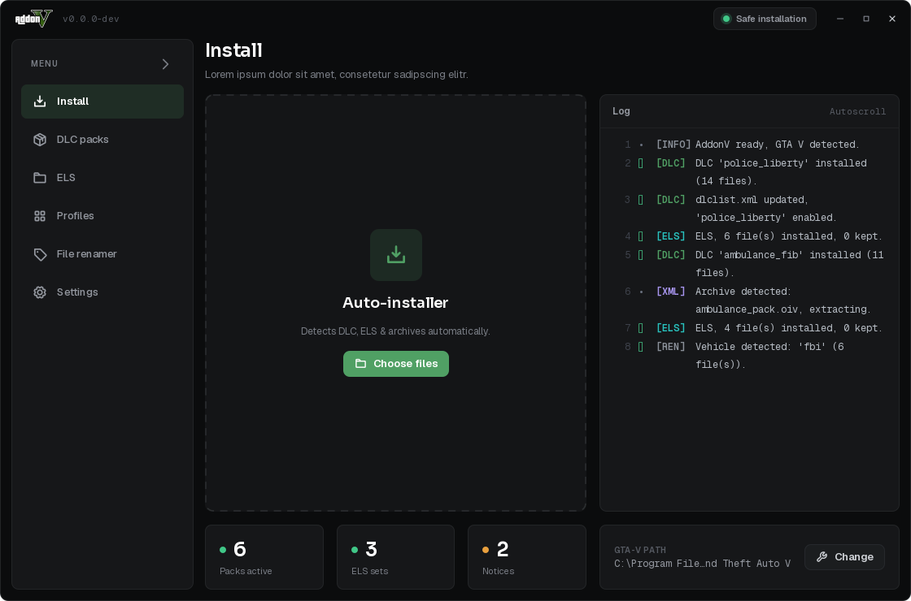
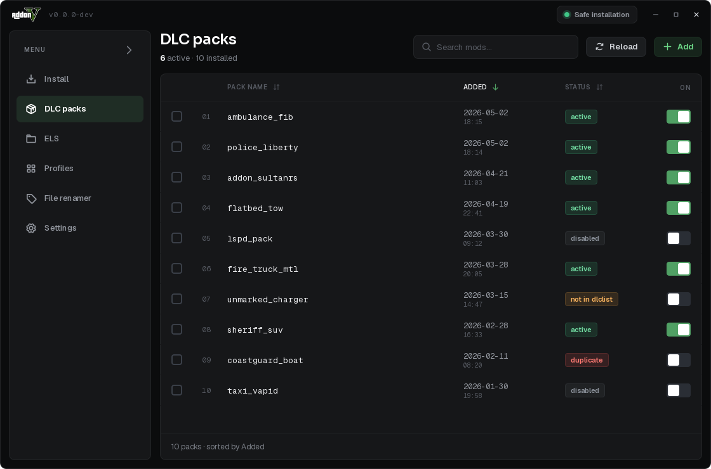
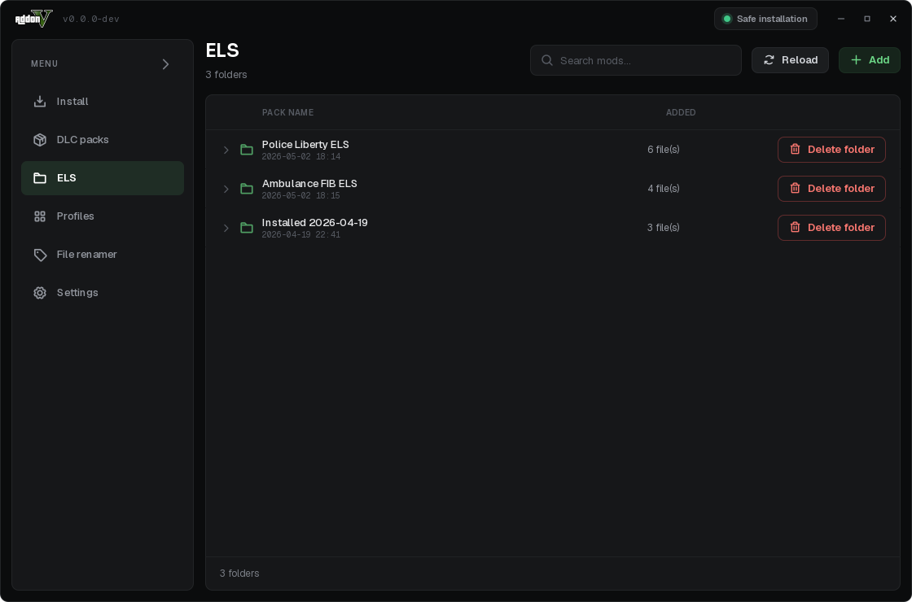
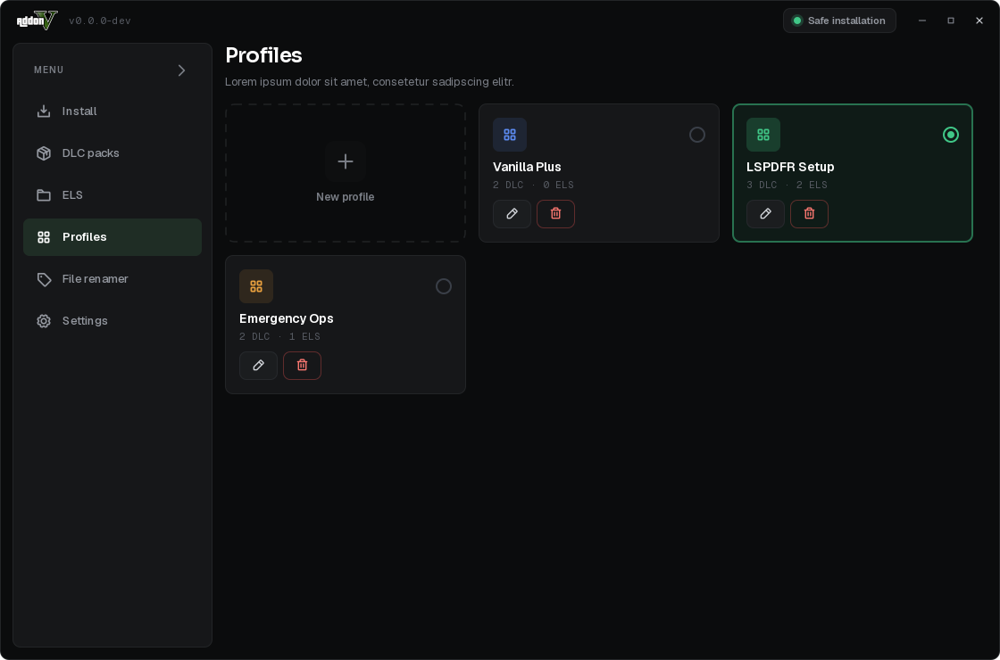
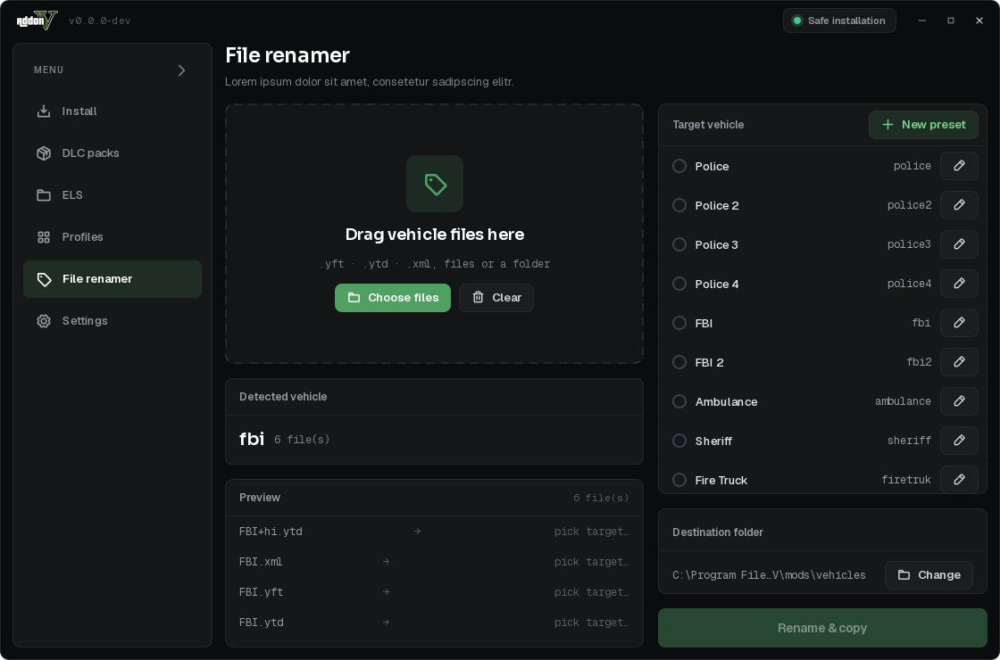

<p align="center">
  
</p>

<p align="center">
  A small, open-source GUI tool to install and manage GTA&nbsp;V single-player mods
  <br>(Add-On DLCs and ELS-VCF vehicle configs) by drag-and-drop.
</p>

<p align="center">
  
  
  
</p>

---

## The interface

AddonV is split into a handful of focused screens, reachable from the sidebar on the
left. Everything is drag-and-drop first, with a safe-by-default install mode that only
ever writes into the OpenIV `mods/` subfolder unless you explicitly turn that off.

### Install



The home screen and drag-and-drop installer. Drop a DLC folder, an ELS `els.xml`, or a
whole archive (`.zip` / `.rar` / `.7z` / `.oiv`) anywhere on the drop area — AddonV detects
what it is from the file's contents (a mislabelled archive still opens), extracts archives
to a temp folder, installs DLC packs into `dlcpacks/` while patching `dlclist.xml` and ELS
files into `ELS/pack_default/`, then cleans up. The **Log** panel on the right streams every
step live, and the tiles along the bottom show packs active, ELS sets and open notices at a
glance — right next to the detected GTA&nbsp;V path.

### DLC packs



The mod manager. Every installed add-on DLC is listed with its install date and current
status — **active**, **disabled**, **not in dlclist**, or **duplicate**. The switch on the
right enables or disables a pack by commenting/uncommenting its entry in `dlclist.xml`, so
you can turn mods on and off without deleting anything. Sort by any column, filter by name,
re-scan the folder, or add more packs.

### ELS



A dedicated view for ELS-VCF vehicle-config files, grouped by the time they were installed.
Expand a group to inspect the individual files it contains, and remove either a single file
or a whole folder in one click.

### Profiles



Saved loadouts. Each profile remembers a specific combination of enabled DLC packs and ELS
sets; activating one (a single click on the tile) switches your entire setup at once — handy
for flipping between, say, a clean install and a full emergency-services build. Create, edit,
delete, and give each profile its own accent colour.

### File renamer



Renames a "replace" vehicle's complete file set (`.yft` / `.ytd` / `.xml`) to another game
model — always as **copies**, so the originals stay untouched. Drop the set, AddonV detects
the base name, you pick a target-model preset, preview the exact result per file, and choose
a destination folder. ELS-VCF XMLs can be auto-routed to the ELS folder instead of the
destination.

> A **Settings** screen (not shown) covers the UI language, terminal-history persistence,
> and the auto-update preference.

---

## Install (end users)

1. Go to the [Releases page](../../releases) and download the latest
   `AddonV-Setup-<version>.exe`.
2. Run it. Choose your language, accept the license/disclaimer, and
   follow the installer wizard.
3. Launch AddonV from the Start Menu. Drag a DLC folder or an
   `els.xml` onto the matching drop zone.

> **Note:** AddonV is unsigned. Windows SmartScreen may warn on first
> launch. Click "More info" → "Run anyway".

## Features

- Auto-detects your GTA&nbsp;V installation
- Safe-by-default: installs into the OpenIV `mods/` subfolder
- Optional direct-install mode (with explicit warning)
- DLC drop zone: copies into `dlcpacks/` and patches `dlclist.xml`
- ELS drop zone: copies ELS-VCF files into `ELS/pack_default/`
- Archive drop: drop a `.zip`/`.oiv`/`.7z`/`.rar`; it's extracted to a temp
  folder, scanned for DLC packs and ELS files, installed, then cleaned up. The
  real format is detected from the file's contents (a mislabelled archive still
  opens), and corrupt files are reported as such. ZIP/OIV and 7z work out of the
  box; installing [7-Zip](https://7-zip.org) enables every format including RAR.
- Mod manager: enable/disable packs (commented out in `dlclist.xml`),
  sort the list, repair it, and spot duplicates
- Profiles: save and switch DLC & ELS loadouts in one click
- File renamer: retarget a replace-vehicle's file set to another model, as copies
- Auto-update: checks GitHub Releases on startup and offers to download and
  install a newer version; can be re-checked from Settings or turned off
- Settings: language, terminal-history persistence, and update preference
- Persistent config in `%USERPROFILE%\.addonv\config.json`

## Build it yourself

### Prerequisites

- Python 3.10+
- [Inno Setup 6](https://jrsoftware.org/isdl.php) (for the installer)

### Steps

```powershell
git clone <repo-url> AddonV
cd AddonV
python -m venv .venv
.\.venv\Scripts\Activate.ps1
pip install -r requirements.txt pyinstaller

# Build dev installer
.\build.ps1

# Build tagged release locally
.\build.ps1 -Version 1.0.0
```

Output: `installer/output/AddonV-Setup-<version>.exe`.

### CI builds

Pushing a tag like `v1.0.0` triggers `.github/workflows/release.yml`,
which builds the installer on a Windows runner and attaches it to a
new GitHub Release.

## Disclaimer

This tool modifies files in your GTA&nbsp;V installation. Modding may
violate Rockstar's EULA and **must not** be used with GTA Online.
Use at your own risk. The full license/disclaimer is shown during
installation and is also in [`installer/eula_en.txt`](installer/eula_en.txt).

## License

[MIT](LICENSE).
